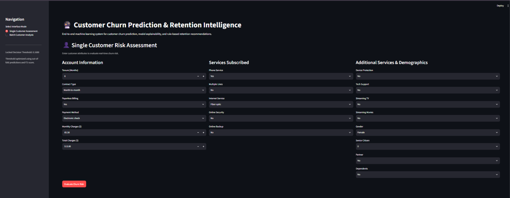
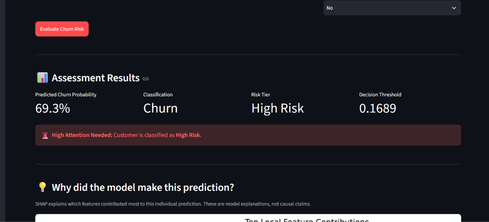
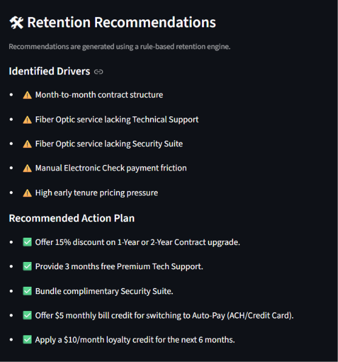
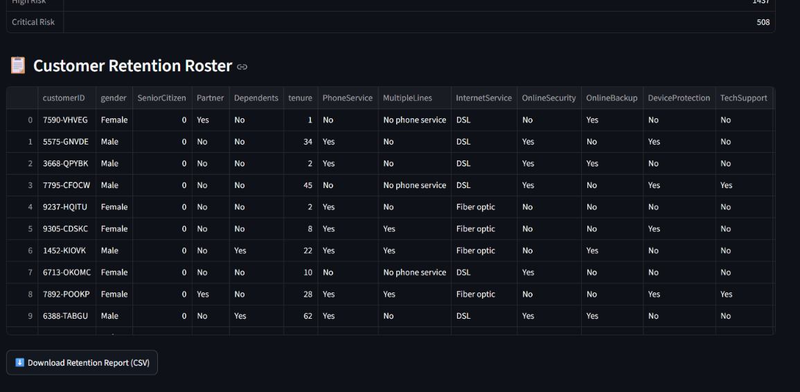

# 🔮 Customer Churn Prediction & Retention Intelligence

An end-to-end machine learning application that predicts customer churn risk, explains individual predictions using SHAP, and generates rule-based retention recommendations through an interactive Streamlit dashboard.

---

## 📌 Overview

Customer churn is a major challenge for subscription-based businesses. Identifying customers who are likely to leave allows businesses to prioritize retention efforts before churn occurs.

This project builds a complete churn prediction pipeline using the Telco Customer Churn dataset.

The system combines:

* Machine learning-based churn prediction
* XGBoost hyperparameter tuning
* Model comparison using cross-validation
* Decision-threshold optimization
* SHAP-based model explainability
* Business-cost sensitivity analysis
* Rule-based retention recommendations
* Interactive Streamlit dashboard
* Batch customer risk analysis

---

## 🎯 Objectives

The project aims to:

1. Predict the probability that a customer will churn.
2. Identify the factors contributing to churn predictions.
3. Prioritize recall so that potential churners are less likely to be missed.
4. Provide actionable retention recommendations.
5. Demonstrate an end-to-end ML workflow from preprocessing to deployment.

---

## 🏗️ System Architecture

```text
Customer Data
      │
      ▼
Data Cleaning & Preprocessing
      │
      ▼
Train / Test Split
      │
      ▼
Model Comparison
(Logistic Regression / Random Forest / XGBoost)
      │
      ▼
XGBoost Hyperparameter Tuning
      │
      ▼
Out-of-Fold Threshold Optimization
      │
      ▼
Final XGBoost Pipeline
      │
      ├──────────────► SHAP Explainability
      │
      ├──────────────► Risk Classification
      │
      └──────────────► Retention Recommendations
                              │
                              ▼
                    Streamlit Dashboard
                              │
                    ┌─────────┴─────────┐
                    ▼                   ▼
             Single Customer      Batch Analysis
```

---

## 🧠 Machine Learning Pipeline

### 1. Data Preprocessing

The preprocessing pipeline handles:

* Numerical feature imputation using median values
* Numerical feature scaling using StandardScaler
* Categorical feature encoding using OneHotEncoder
* Unknown categorical values using `handle_unknown="ignore"`

The customer ID is excluded from model training because it does not provide predictive value.

---

### 2. Model Comparison

Three classification algorithms were evaluated using **5-fold stratified cross-validation**:

* Logistic Regression
* Random Forest
* XGBoost

### Cross-Validation Results

| Model               |    ROC-AUC |     PR-AUC | Precision | Recall |     F1 |     F2 |
| ------------------- | ---------: | ---------: | --------: | -----: | -----: | -----: |
| Logistic Regression |     0.8460 |     0.6613 |    0.6526 | 0.5425 | 0.5918 | 0.5611 |
| Random Forest       |     0.8205 |     0.6130 |    0.6268 | 0.4856 | 0.5470 | 0.5084 |
| **XGBoost**         | **0.8508** | **0.6713** |    0.6765 | 0.5211 | 0.5885 | 0.5461 |

XGBoost achieved the highest cross-validation ROC-AUC and PR-AUC and was therefore selected for the final pipeline.

---

## ⚙️ Hyperparameter Tuning

XGBoost hyperparameters were optimized using `RandomizedSearchCV` with:

* 5-fold stratified cross-validation
* ROC-AUC as the optimization metric
* 15 randomized parameter combinations

The final selected configuration included:

```text
n_estimators     = 100
max_depth        = 3
learning_rate    = 0.05
subsample        = 0.8
colsample_bytree = 0.8
gamma            = 0.2
reg_alpha        = 0
reg_lambda       = 5.0
```

Best cross-validation ROC-AUC:

**0.8508**

---

## 🎯 Decision Threshold Optimization

Instead of automatically using the default classification threshold of `0.50`, the project optimizes the decision threshold using **out-of-fold predictions from the training data**.

The objective is to maximize the **F2-score**, giving greater importance to recall.

### Optimized Threshold

```text
0.1689
```

The threshold is selected before evaluating the untouched test set and then locked for final evaluation.

This approach helps prioritize identifying potential churners rather than simply maximizing overall accuracy.

---

## 📊 Final Test Set Performance

The final model was evaluated on an untouched test set of **1,409 customers**.

| Metric             |     Result |
| ------------------ | ---------: |
| ROC-AUC            | **0.8469** |
| PR-AUC             | **0.6628** |
| Accuracy           |     0.6820 |
| Precision          |     0.4497 |
| Recall             | **0.8850** |
| F1-score           |     0.5964 |
| F2-score           | **0.7415** |
| Decision Threshold | **0.1689** |

### Confusion Matrix

```text
True Negatives  (TN): 630
False Positives (FP): 405
False Negatives (FN): 43
True Positives  (TP): 331
```

The optimized threshold identifies **88.5% of the actual churners** in the held-out test set.

The trade-off is lower precision because the system intentionally prioritizes identifying more potential churners.

---

## 🔍 SHAP Explainability

SHAP (SHapley Additive exPlanations) is used to explain model predictions.

### Top Global Model Drivers

| Feature                           | Mean Absolute SHAP |
| --------------------------------- | -----------------: |
| Contract — Month-to-month         |             0.6450 |
| Tenure                            |             0.3592 |
| Online Security — No              |             0.2370 |
| Internet Service — Fiber optic    |             0.2285 |
| Monthly Charges                   |             0.1900 |
| Tech Support — No                 |             0.1791 |
| Payment Method — Electronic check |             0.1502 |
| Contract — Two year               |             0.1367 |
| Total Charges                     |             0.1209 |
| Paperless Billing — No            |             0.0936 |

The dashboard also provides **local SHAP explanations** for individual customers, showing which features contributed most to a particular prediction.

> SHAP values explain the behavior of the trained model and should not be interpreted as proof of causal relationships.

---

## 💰 Business Cost Analysis

A separate threshold sensitivity analysis evaluates the trade-off between:

* Cost of contacting/intervening with a customer
* Cost of missing a customer who eventually churns

For demonstration purposes, the analysis assumes:

```text
Intervention cost = $10
Missed churn cost = $100
```

These are **illustrative assumptions**, not real company costs.

Under these assumptions:

```text
F2-optimized threshold     = 0.1689
Cost-minimizing threshold  = 0.12
Minimum assumed cost       = $10,590
```

This demonstrates how the preferred classification threshold can change depending on the business objective and cost structure.

The production pipeline retains the **0.1689 F2-optimized threshold** because the project's primary objective is to prioritize churn recall.

---

## 🛠️ Retention Recommendation Engine

The application includes a rule-based retention engine that converts customer characteristics and risk information into suggested actions.

Examples include recommendations related to:

* Contract type
* Tenure
* Online security
* Technical support
* Payment method
* Service configuration
* Customer risk level

These recommendations are **rule-based business suggestions**, not machine-learning predictions or causal interventions.

---
## 🖥️ Dashboard Preview

### 1. Customer Assessment Dashboard

The dashboard allows users to enter customer details and evaluate individual churn risk.



### 2. Churn Prediction & SHAP Explanation

The system displays the predicted churn probability, risk tier, decision threshold, and SHAP-based feature contributions for the individual prediction.



### 3. Retention Recommendations

The rule-based retention engine identifies potential churn drivers and generates actionable retention strategies.



### 4. Batch Customer Analysis

The application supports batch analysis of customer records and generates a retention roster that can be downloaded as a CSV report.



### 👤 Single Customer Assessment

Users can enter customer information and receive:

* Churn probability
* Churn / No-Churn classification
* Risk tier
* Decision threshold
* Local SHAP explanation
* Retention recommendations

### 📂 Batch Customer Analysis

Users can upload a CSV containing customer records and generate:

* Risk classifications
* Customer-level predictions
* Retention roster
* Downloadable CSV report

---

## 🧰 Technology Stack

### Programming

* Python

### Machine Learning

* Scikit-learn
* XGBoost
* SHAP

### Data Processing

* Pandas
* NumPy

### Visualization

* Matplotlib
* Streamlit

### Model Persistence

* Joblib

### Development

* Jupyter Notebook
* Git
* GitHub

---

## 📁 Project Structure

```text
churn_prediction_project/
│
├── data/
│   └── WA_Fn-UseC_-Telco-Customer-Churn.csv
│
├── models/
│   └── pipeline.pkl
│
├── results/
│   ├── model_comparison.csv
│   ├── shap_feature_importance.csv
│   ├── shap_summary.png
│   └── business_cost_analysis.csv
│
├── src/
│   ├── preprocessing.py
│   ├── train.py
│   ├── model_comparison.py
│   ├── shap_analysis.py
│   ├── business_cost_analysis.py
│   └── recommendations.py
│
├── 01_eda.ipynb
├── app.py
├── requirements.txt
├── .gitignore
└── README.md
```

---

## 🚀 Installation

Clone the repository:

```bash
git clone https://github.com/LikithaOnteru/Churn_prediction.git
```

Navigate into the project:

```bash
cd Churn_prediction
```

Create a virtual environment:

```bash
python -m venv .venv
```

Activate it on Windows:

```bash
.venv\Scripts\activate
```

Install dependencies:

```bash
pip install -r requirements.txt
```

---

## ▶️ Training the Model

Run:

```bash
python src/train.py
```

This performs:

1. Data preprocessing
2. Hyperparameter search
3. Cross-validation
4. Out-of-fold threshold optimization
5. Final test evaluation
6. Model artifact generation

The canonical artifact is saved to:

```text
models/pipeline.pkl
```

---

## 📊 Run Model Comparison

```bash
python src/model_comparison.py
```

Results are saved to:

```text
results/model_comparison.csv
```

---

## 🔍 Run SHAP Analysis

```bash
python src/shap_analysis.py
```

Outputs:

```text
results/shap_feature_importance.csv
results/shap_summary.png
```

---

## 💰 Run Business Cost Analysis

```bash
python src/business_cost_analysis.py
```

Output:

```text
results/business_cost_analysis.csv
```

---

## 🌐 Run the Streamlit Application

```bash
streamlit run app.py
```

The application provides the interactive churn prediction and retention dashboard.

---

## ⚠️ Limitations

* The dataset is a publicly available Telco Customer Churn dataset and may not represent real-world production data.
* Business cost values are illustrative assumptions.
* SHAP explanations describe model behavior rather than causal relationships.
* Retention recommendations are rule-based and do not guarantee churn reduction.
* Model performance may change when applied to a different customer population or future data.
* The current project focuses on predictive modeling rather than real-time production deployment.

---

## 🔮 Future Improvements

Potential future improvements include:

* Probability calibration
* Automated model monitoring
* Drift detection
* Cost-sensitive model optimization using real business costs
* Integration with CRM systems
* Real customer retention campaign feedback
* A/B testing of retention strategies
* Automated retraining pipelines

---

## 👩‍💻 Author

**Onteru Naga Likitha**

B.Tech — Artificial Intelligence & Machine Learning

Shri Vishnu Engineering College for Women

---

## ⭐ Key Takeaway

This project demonstrates a complete machine learning workflow:

```text
Data
 ↓
Preprocessing
 ↓
Model Comparison
 ↓
Hyperparameter Tuning
 ↓
Threshold Optimization
 ↓
Test Evaluation
 ↓
SHAP Explainability
 ↓
Business Cost Analysis
 ↓
Retention Recommendations
 ↓
Interactive Deployment
```

The goal is not only to predict **who may churn**, but also to explain **why the model predicts churn** and provide a structured way to prioritize retention efforts.
